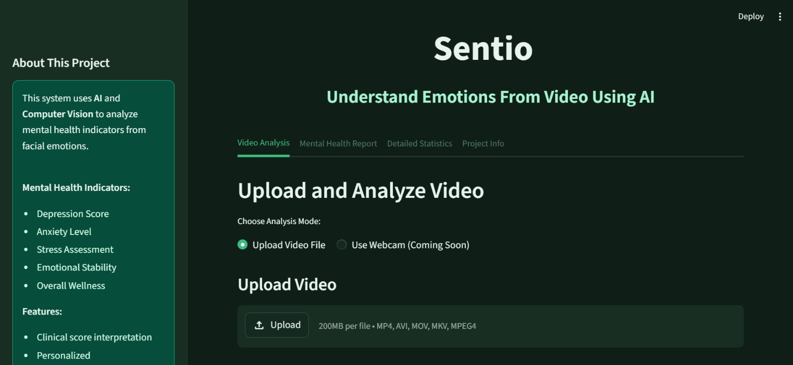
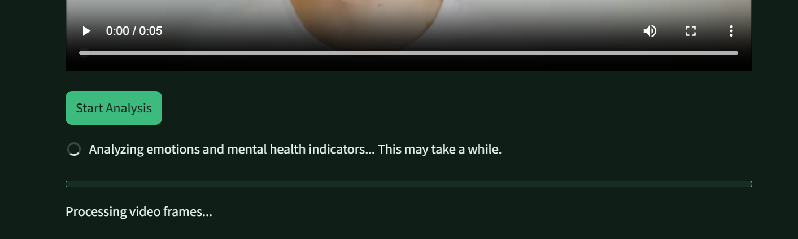
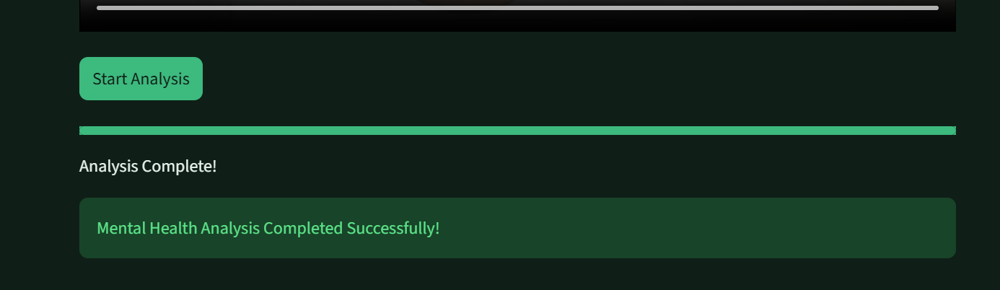
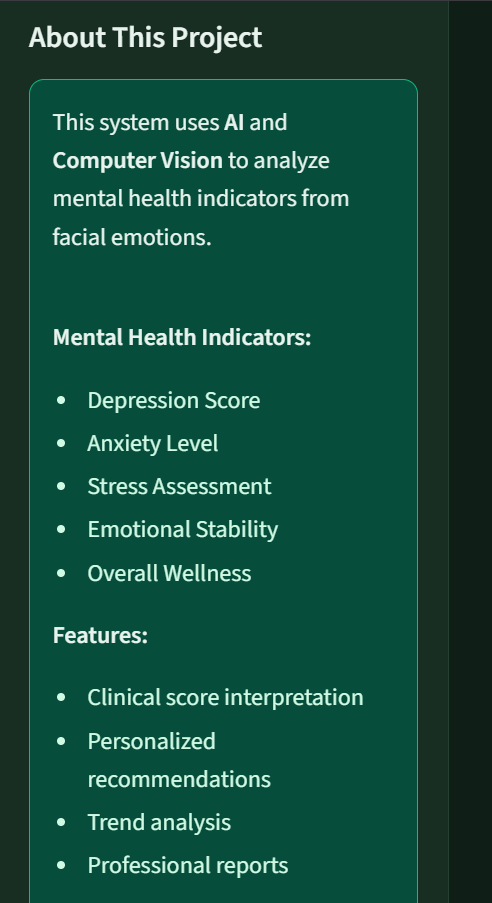
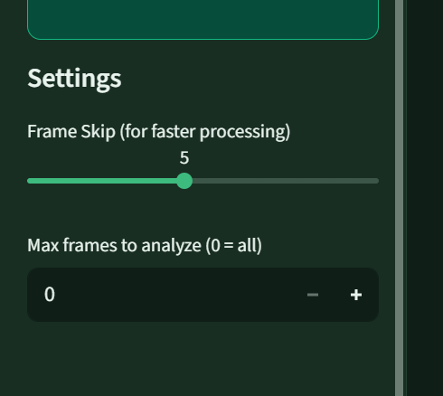

# 🧠 Sentio — Mental Health Video Analysis


> **Sentio** is an AI-powered web application that uses **DeepFace** and **Computer Vision** to analyze facial emotions from video and generate mental health indicators — including Depression Score, Anxiety Level, Stress Assessment, Emotional Stability, and Overall Wellness.

---

## Screenshots

| Home & Upload | Video Processing | Analysis Complete |
|:---:|:---:|:---:|
|  |  |  |

| Sidebar Info | Settings |
|:---:|:---:|
|  |  |

---

## Features

-  **Video Upload** — Supports MP4, AVI, MOV, MKV formats
-  **AI Emotion Recognition** — Frame-by-frame analysis using DeepFace deep learning models
-  **7 Emotions Detected** — Happy, Sad, Angry, Fear, Surprise, Disgust, Neutral
-  **5 Mental Health Indicators** — Research-weighted scoring algorithm:
  - Depression Score
  - Anxiety Level
  - Stress Assessment
  - Emotional Stability
  - Overall Wellness
- **Mental Health Report Tab** — Clinical interpretation (Low / Moderate / High) with personalized recommendations
- **Detailed Statistics Tab** — Emotion distribution table, interactive timeline charts (Plotly)
- **Export Results** — Download raw data as CSV and full report as TXT
- **Performance Controls** — Adjustable Frame Skip (1–10) and Max Frames limit
- **Webcam Mode** *(Coming Soon)*

---

## Project Structure

```
MENTAL_HEALTH_PROJECT/
│
├── streamlit_app.py           # Main web app — UI, tabs, charts, downloads
├── mental_health_analyzer.py  # Core AI engine — emotion detection & scoring
├── emotion_analysis.xlsx      # Sample emotion output data
├── requirements.txt           # Python dependencies
├── README.md                  # Project documentation
│
├── .streamlit/                # Streamlit theme/config
├── results/                   # Auto-generated output charts
│   ├── mental_health_dashboard.png
│   └── mental_health_metrics.png
│
└── screenshots/               # README screenshots (add manually)
```

---

## Getting Started

### 1. Clone the Repository

```bash
git clone https://github.com/aanam-shaikh/MENTAL_HEALTH_PROJECT.git
cd MENTAL_HEALTH_PROJECT
```

### 2. (Recommended) Create a Virtual Environment

```bash
# Windows
python -m venv venv
venv\Scripts\activate

# macOS / Linux
python3 -m venv venv
source venv/bin/activate
```

### 3. Install Dependencies

```bash
pip install -r requirements.txt
```

Or install manually:

```bash
pip install streamlit deepface opencv-python pandas numpy plotly matplotlib pillow tf-keras
```

> **Note:** On first run, DeepFace will automatically download pre-trained model weights. Make sure you have an internet connection.

### 4. Run the App

```bash
streamlit run streamlit_app.py
```

Open your browser at `http://localhost:8501`

---

## Usage

### Web App (Recommended)

1. Upload a video file (MP4, AVI, MOV, MKV)
2. Optionally adjust **Frame Skip** and **Max Frames** in the sidebar
3. Click **Start Analysis**
4. Explore results across the 4 tabs:
   - **Video Analysis** — Upload & run analysis
   - **Mental Health Report** — Scores + clinical interpretation + recommendations
   - **Detailed Statistics** — Charts, emotion timeline, distribution table
   - **Project Info** — Methodology, ethics, crisis resources

### Command Line

You can also run the analyzer directly from the terminal:

```bash
python mental_health_analyzer.py
```

### As a Python Module

```python
from mental_health_analyzer import MentalHealthAnalyzer

analyzer = MentalHealthAnalyzer()

# Analyze video
df = analyzer.analyze_video_file('video.mp4', skip_frames=5, max_frames=None)

# Get scores
scores = analyzer.calculate_mental_health_scores(df)

# Get interpretation + recommendations
interpretations = analyzer.interpret_scores(scores)

# Save full report + visualizations
analyzer.create_mental_health_report(df)
analyzer.create_visualizations(df, scores, output_dir='results')
```

---

##  How Scoring Works

The `MentalHealthAnalyzer` uses **research-based emotion weights** to calculate each score:

| Indicator | Key Emotions (High Weight) | Reducer |
|---|---|---|
| Depression | Sad (3.0), Angry (2.0), Neutral (1.5) | Happy (-2.0) |
| Anxiety | Fear (3.0), Angry (2.0), Surprise (1.5) | Happy (-2.0) |
| Stress | Angry (3.0), Fear (2.5), Disgust (2.0) | Happy (-2.0) |

Scores are normalized to a **0–100 scale** and classified as:
- 🟢 **Low** — Below 30
- 🟡 **Moderate** — 30 to 60
- 🔴 **High** — Above 60

**Emotional Stability** is calculated from how frequently dominant emotions change across frames.

**Overall Wellness** = `100 - average(Depression, Anxiety, Stress)`

---

## Dependencies

| Package | Purpose |
|---|---|
| `streamlit` | Web application framework |
| `deepface` | Facial emotion recognition (AI models) |
| `opencv-python` | Video frame extraction & face detection |
| `pandas` | Data analysis and CSV export |
| `numpy` | Numerical calculations |
| `plotly` | Interactive charts in the web UI |
| `matplotlib` | Static chart generation for saved outputs |
| `tf-keras` | Backend for DeepFace models |
| `pillow` | Image handling |

---

## Output Files

| File | Description |
|---|---|
| `emotion_analysis.csv` | Frame-by-frame raw emotion scores |
| `analysis_report.txt` | Full mental health report with scores & recommendations |
| `results/mental_health_dashboard.png` | 4-panel chart: indicators, wellness gauge, emotion distribution, stability timeline |
| `results/mental_health_metrics.png` | Bar chart comparing all 5 mental health metrics |

---

## Configuration

| Setting | Range | Default | Effect |
|---|---|---|---|
| Frame Skip | 1–10 | 5 | Analyze every Nth frame (higher = faster) |
| Max Frames | 0–1000 | 0 (all) | Limit total frames analyzed |

---

## Ethical Considerations

- **This is NOT a diagnostic tool** — it provides general indicators only
- Always obtain **informed consent** before analyzing anyone's video
- Facial expressions are **one indicator** — they don't capture full mental state
- Results can vary with lighting, angle, video quality, and cultural differences
- **For clinical or treatment decisions, always consult a qualified mental health professional**

**Crisis Resources (India):**
- iCall: 9152987821
- Vandrevala Foundation: 1860-2662-345 (24/7)
- Tele-MANAS: 14416

---

## Future Roadmap

- [ ] Live webcam analysis
- [ ] Multi-face tracking
- [ ] Audio/speech emotion analysis
- [ ] Longitudinal tracking across sessions
- [ ] Mobile application
- [ ] REST API for integration
- [ ] Cloud deployment (Streamlit Cloud / AWS)

---

## 📄 License

This project is licensed under the MIT License.

---

## 🙏 Acknowledgments

- [DeepFace](https://github.com/serengil/deepface) — for accessible deep learning facial analysis
- [OpenCV](https://opencv.org/) — for computer vision tools
- [Streamlit](https://streamlit.io/) — for the web framework
- FER-2013 dataset & mental health research community

---

## 👤 Author

**Aanam Shaikh**
- GitHub: [@aanam-shaikh](https://github.com/aanam-shaikh)
- LinkedIn: [Your LinkedIn](https://www.linkedin.com/in/aanam-shaikh-941a01256/)

---

<p align="center">
  Built with ❤️ for mental health awareness and AI education<br>
  <i>Remember: Your mental health matters. This tool supports awareness — professional help is always encouraged.</i>
</p>
